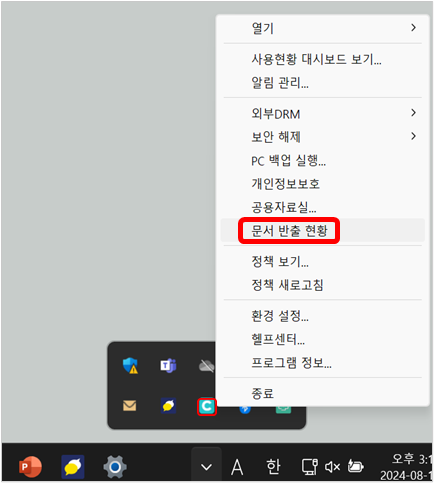

# 문서반출 신청 승인/반려하기

erterwertwertwertwertwert사용자가 문서반출을 신청하면 승인권자에게 알림 메시지 또는 이메일로 신청 정보가 전송됩니다. 승인권자는 윈도우 에이전트 알림 관리, 이메일을 통하거나 바로 문서 반출 웹페이지에서 문서반출 신청을 확인하고 승인/반려할 수 있습니다.

### <mark style="color:$primary;">사용자 웹 페이지에서 승인/반려하기</mark>

1\.  문서중앙화 웹페이지에 로그인한 후, 화면 왼쪽 메뉴에서 **반출 관리 – 문서 반출** 메뉴를 클릭합니다.

2\.  다음과 같은 **문서 반출** 화면이 나타납니다. 승인대기 중인 문서 반출 신청이 있는 경우, 결재 관리 탭에 승인대기 신청 개수만큼 숫자가 표시됩니다. **결재 관리** 탭을 클릭합니다.&#x20;

<figure><figcaption></figcaption></figure>

3\.  승인대기 중인 신청 건이 있는 경우에는 화면 하단에 기본적으로 전체 기간, 모든 결재 방식, 결재 상태는 **대기**(결재되기 전 상태) 조건으로 조회된 신청 목록이 표시됩니다. 최근에 요청된 신청일수록 목록의 위에 위치합니다.

<figure><figcaption></figcaption></figure>

\
4\.  필요시 검색 조건으로 **제목, 승인권자 ID, 승인권자 이름**을 입력하여 **검색** 버튼을 클릭합니다. 이때 검색어의 일부만 입력하여 검색할 수 있습니다.

5\.  **페이지 하단에 표시된 목록**에서 각 신청 이력의 **신청 일시, 제목, 신청자 이름(ID), 결재 상태, 결재일시**를 확인할 수 있습니다.

.png>)

6\.  승인대기 중인 신청을 결재하는 방법에는 **일괄 승인**과 **신청 건 별 승인**이 있습니다.

* **일괄 승인** : 일반적으로 대기 중인 신청 목록에서 다수의 신청 건을 한 번에 승인할 때 활용하며, 신청 건 왼쪽 체크박스를 선택 후 목록 우측 상단의 **일괄승인** 버튼을 클릭하면 바로 승인이 완료됩니다.
* **신청 건 별 승인** : 목록에서 제목을 클릭하여 해당 신청 건의 **상세보기** 화면으로 이동합니다.

7\.  **상세 보기** 화면에서 추가적으로 **반출 기한, 반출 종류, 반출가능 디스크, 신청 내용, 반출 목록**을 확인할 수 있습니다. **반출목록**에서 반출 신청된 각 파일명, 파일 크기, 파일 보안등급, 폴더 경로를 확인할 수 있고, 파일명을 클릭하면 파일을 다운로드하여 내용을 확인할 수 있습니다.

.png>)

* **반출 기한**: **DOC\_EXPORT** 폴더에 생성된 반출 폴더/파일을 사용할 수 있는 기간
* **반출 종류**: 공개 반출 또는 보안 반출
* **반출 가능 디스크**: 반출 문서를 다운로드할 디스크
* **반출 목록**: 반출 신청 파일이 속한 문서함, 반출 신청된 파일 목록. 파일명, 파일크기, 문서보안등급, 폴더 경로

8\.  상세 정보를 확인한 후 화면 하단의 **승인** 또는 **반려** 버튼을 클릭하여 결재를 진행합니다. 신청을 승인하지 않고 문서반출 신청 목록을 보여주는 이전 화면으로 돌아가려면 오른쪽 아래에 있는 **목록** 버튼을 누릅니다.

9\.  사유 입력창이 나타나면 승인 또는 반려 사유를 입력한 후 **확인** 버튼을 클릭하면 결재 작업이 완료됩니다.

10\.  ‘**문서 반출**’ 웹페이지 상세 보기 화면에 작업 결과가 **대기**에서 **승인** 또는 **반려**로 바로 변경되어 표시됩니다. 또한 결재일시와 승인/반려 사유가 함께 표시됩니다. 승인권자의 결재 작업이 완료되면 신청자에게 결재 완료 알림과 이메일이 전송됩니다.

.png>)

### <mark style="color:$primary;">알림, 이메일에서 승인/반려하기</mark>

승인권자는 윈도우 에이전트의 알림이나 이메일로 수신한 문서반출 신청 정보를 확인 후 결재 상세 웹페이지로 이동하여 승인/반려할 수도 있습니다. 단, 승인권자가 사용자 자신인 자가승인의 경우, 이메일은 발송되지 않습니다.

1\.  윈도우 에이전트 알림 또는 이메일에서 **결재 페이지로 이동하기**를 클릭하여 **문서반출** 웹페이지의 **결재 관리** 상세보기 페이지로 이동합니다. 

<figure><figcaption></figcaption></figure>

<figure><figcaption></figcaption></figure>

\
&#x20;  2\.  본 아티클의 목차 [**사용자 웹 페이지에서 승인/반려하기**](approve.md#undefined) **7번 항목**를 수행합니다.


문서중앙화 트레이 메뉴에서 사용자의 문서반출 웹페이지로 접근하는 것도 가능합니다.

1\.   윈도우 작업 표시줄 오른쪽 하단에 있는 알림 영역에서 문서중앙화 트레이 아이콘 .png>)을 마우스 오른쪽 버튼으로 클릭한 후 **문서 반출 현황** 메뉴을 선택합니다.

\
2\.   사용자의 **문서반출** 웹페이지에서 **결재관리** 탭을 클릭한 후 승인 또는 반려 작업을 할 수 있습니다.


