# 문서반출 신청 및 반출하기

로컬저장금지 정책 등 관리자가 설정한 DiskLock정책에 따라, 중앙문서함에서 사용자 PC 로컬 디스크로의 파일 복사/이동과 이메일, 메신저 등에서의 파일 첨부가 금지될 수 있습니다. 중앙문서함의 문서를 외부로 반출해야 할 필요가 있는 경우에는 문서반출 기능을 이용하여 문서를 메일 또는 메신저에 첨부하여 전달하거나 고정 디스크나 이동식 디스크 등에 저장하여 반출하는 것이 가능합니다. 반출 디스크로 반출된 문서는 중앙문서함에 로그인 하지 않은 상태에서만 파일 수정 작업을 할 수 있습니다.

문서 반출 기본 절차는 아래와 같습니다.

 사용자의 문서 반출 신청 (반출 종류, 결재방법, 승인권자 등 설정)

 승인권자의 반출 승인 (후결재인 경우 반출후 승인 가능)

 반출 폴더/파일 생성(반출 전용 폴더 DOC\_EXPORT에 생성일시 폴더와 파일 생성)

 사용자의 문서 반출


문서 반출 기능에 대한 상세한 내용은 [**문서반출 기능 소개**](../../) 를 참조하세요.


### <mark style="color:$primary;">문서반출 신청하기</mark>

사용자가 문서 반출을 신청하는 방법은 다음과 같습니다.

1. 윈도우 탐색기에서 반출 신청할 파일 또는 폴더를 선택한 후 마우스 오른쪽 버튼을 클릭하여 **반출 신청**을 선택합니다. 폴더 반출은 관리자가 허용한 경우에만 가능합니다.

<figure><figcaption></figcaption></figure>

2. **‘반출 신청’** 창에서 반출 종류/기간 등을 설정하고 승인권자에게 전달할 내용을 입력하여 반출 신청서를 작성합니다.

<figure><figcaption></figcaption></figure>

* **제목** : 문서반출 신청서의 제목입니다. 문서 반출 신청 이력, 승인권자 결재 목록에 제목으로 표시됩니다.
* **승인권자** : 신청자의 문서반출을 승인/반려하는 승인권자 목록을 확인 후 승인권자를 선택합니다.


승인권자는 관리자의 설정에 따라 **팀장/팀문서관리자** 또는 **폴더관리자** 중에서 선택할 수 있습니다. 단, 관리자가 **자가승인**을 허용한 경우에는 승인권자가 사용자 본인으로 자동 지정됩니다.


* **결재 방법** : 관리자 설정에 따라 **선결재/후결재** 중에 선택이 되어 있거나 선택할 수 있습니다.

> .png>) **선결재** : 반출 신청 후 승인권자의 반출 승인이 완료된 후에만 문서반출이 가능합니다.
>
> .png>) **후결재** : 반출 신청 후 곧바로 문서 반출이 가능하며 승인권자는 사후 승인합니다.

* **반출 종류** : **공개반출**과 **보안반출**이 있습니다

>  **공개반출**: 반출 문서는 반출 디스크, 고정 디스크, 이동식 디스크, 네트워크 디스크 등으로 다운로드 가능하고, 이메일, 메신저 등에 반출 문서를 첨부할 수 있습니다. 관리자의 설정에 따라 반출 가능한 디스크가 제한될 수도 있습니다.
>
> .png>) **보안반출**: 반출문서를 반출 디스크로만 다운로드할 수 있습니다. 고정 디스크, 이동식 디스크, 네트워크 디스크 등으로는 다운로드 불가능하고 이메일, 메신저 등에 반출 문서를 첨부할 수 없습니다.

* **반출 기간** : 반출 신청한 파일/폴더가 속한 문서함의 **DOC\_EXPORT** 폴더에 생성된 반출용 폴더 내 파일/폴더를 사용할 수 있는 기간입니다. 지정된 반출 기간이 경과하면, 해당 반출용 폴더는 삭제됩니다.
* **반출 가능한 디스크** : 공개반출 사용시 반출 문서를 다운로드 할 디스크를 선택합니다. 관리자의 설정에 따라 선택할 수 있는 디스크가 제한됩니다. 보안반출 사용 시에는 반출디스크로 고정됩니다.
* **내용** : 반출 문서 신청에 대해 승인권자가 확인할 내용을 작성합니다.
* **총 반출용량:** 반출 목록에 등록된 파일의 총 용량입니다.관리자가 1회 반출용량을 제한한 경우 총 반출용량이 1회 반출 용량을 초과할 수 없습니다.
* **반출 목록** : 반출 신청 대상 문서 목록을 보여줍니다.


반출 신청한 파일의 총용량이 관리자가 설정한 용량을 초과할 경우 경고 메시지가 표시됩니다. 반출 가능 용량은 반출목록 우측에서 확인할 수 있고, 필요한 경우 정보보호관리자 또는 서비스관리자에게 용량 변경을 요청할 수도 있습니다.

.png>)


3. 선택한 문서 외에 반출 신청할 문서를 추가하고자 한다면 ‘**반출 신청**’ 창 하단의 **파일추가** 버튼을 클릭합니다. 표시된 파일탐색기에서 파일을 선택한 후 **열기** 버튼을 클릭합니다.


파일 추가는 반출 목록에 있는 파일과 동일한 드라이브에 있고, 승인권자가 동일한 파일만 가능 합니다.


<figure><figcaption></figcaption></figure>

<figure><figcaption></figcaption></figure>

반출 대상으로 선택된 다수의 파일/폴더 중 제외할 대상은 반출 목록에서 선택한 후 **제거** 버튼을 클릭합니다.

<figure><figcaption></figcaption></figure>


폴더 반출이 허용된 경우에는 폴더 추가도 가능합니다. 폴더 추가 방법은 아래와 같습니다.

1. ‘반출 신청’ 창에서 폴더추가 버튼 클릭합니다.
2. ‘폴더 찾아보기’ 창에서 반출하고자 하는 폴더를 선택 확인 버튼을 클릭합니다.

.png>) 

.png>)


4. ‘**반출 신청**’ 창에서 하단의 **반출 목록** 확인 후 **신청** 버튼을 클릭하여 문서반출 신청을 완료합니다.

<figure><figcaption></figcaption></figure>

5. 후결재 신청인 경우에는 신청 완료 후 바로 해당 문서함의 DOC\_EXPORT폴더에 폴더명이 ‘해당 폴더의 생성일시’인 반출용 폴더가 생성되고, 폴더 아래로 반출 대상 폴더/파일이 복사됩니다. 선결재 신청인 경우에는 승인권자의 승인 완료 후에 이 과정이 진행되며, 승인 대기 상태에서는 문서반출 신청을 취소할 수 있습니다. DOC\_EXPORT에 생성된 반출용 폴더는 반출 기간이 지나면 삭제됩니다.

<figure>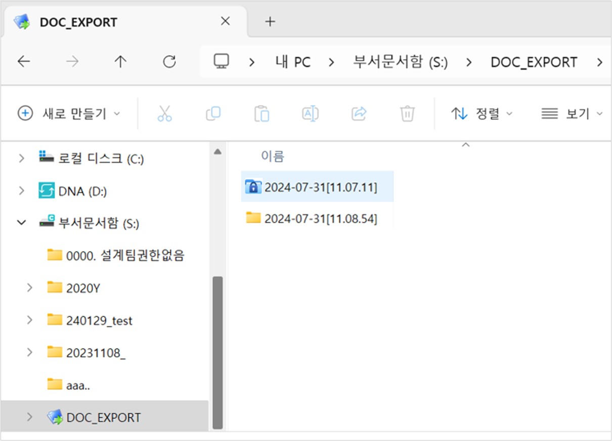<figcaption></figcaption></figure>


DOC\_EXPORT폴더에 생성되는 반출용 폴더는 반출 종류에 따라서 아이콘이 구분되어 표시됩니다.\
아래 그림에서 2025-01-31\[14.22.40]폴더는 보안 반출용 폴더,  2024-01-31\[14.23.49] 폴더는 공개 반출용 폴더입니다.

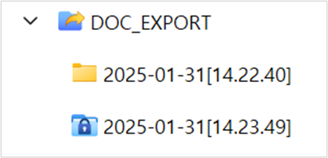


6. 반출신청이 완료되면 사용자에게는 이메일이 전송되고, 승인권자에게는 문서 반출 승인이 요청되었음을 알리는 알림 및 이메일이 발송됩니다.


승인권자의 승인 여부는 승인/반려 시 사용자에게 발송되는 알림 또는 이메일을 통해 확인하거나, 사용자 웹페이지 문서 반출 신청 이력에서 확인할 수 있습니다. 문서반출 신청 이력을 조회하고, 선결재 대기중인 신청 건을 취소하는 방법은 [**문서 반출 신청 이력 및 결재 상태 확인하기**](/broken/pages/RQmvXsdLsn8kniHYqlB1)를참고합니다.


### <mark style="color:$primary;">문서 반출하기</mark>

사용자는 문서함의 DOC\_EXPORT폴더에 생성된 반출용 폴더 아래의 폴더/파일을 반출 가능 디스크로 반출할 수 있습니다.

다음은 “부서문서함\마케팅” 폴더의 “마케팅부서드라이브.txt” 파일을 선결재 공개반출 신청한 경우의 예입니다. 반출이 승인되면 다음 그림과 같이 “부서문서함\ DOC\_EXPORT \ 2024-07-31\[11.08.54]” 폴더 내에 “마케팅부서드라이브.txt” 파일이 복사됩니다. 이제 이 파일을 반출 신청 시 선택한 디스크로 반출할 수 있습니다.

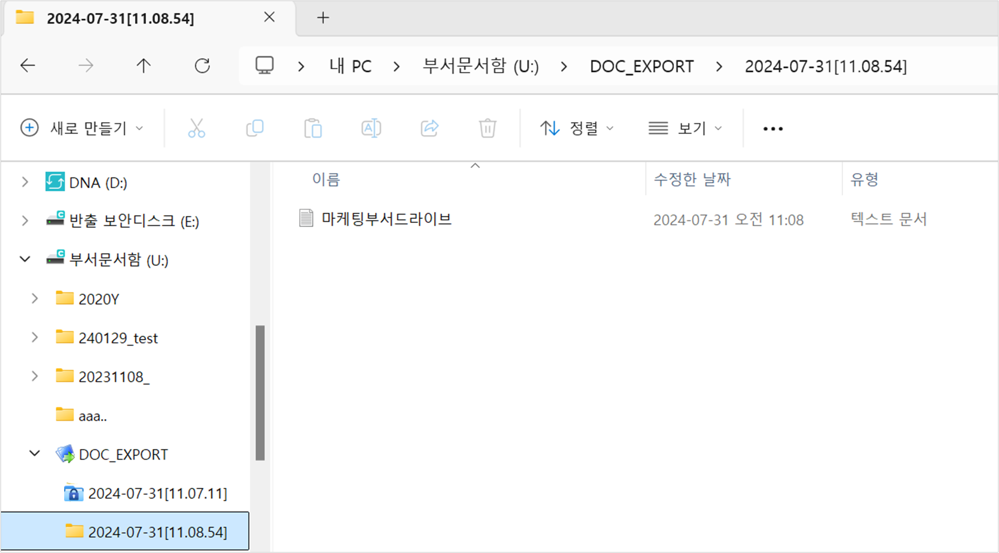

#### 공개반출 문서 반출하기

반출용 폴더 아래의 폴더/파일을 반출 신청 시 선택한 사용자의 로컬 디스크로 다운로드할 수 있고 필요에 따라서 이메일 등에 첨부하여 외부로 전송이 가능합니다. 다운로드 방법과 첨부하는 방법은 아래와 같습니다.

<mark style="color:$primary;">**로컬 디스크로 반출하기**</mark><mark style="color:$primary;">(</mark><mark style="color:$primary;">**반출 디스크 제외)**</mark>

다음과 같이 DOC\_EXPORT 폴더 아래의 폴더/파일을 고정 디스크, 이동식 디스크 등 반출 신청 시 선택했던 반출 가능 디스크로 다운로드할 수 있습니다.

1. DOC\_EXPORT 폴더 아래 반출하고자 하는 폴더/파일을 선택하고 오른쪽 마우스 클릭 후 **문서 반출** 메뉴를 선택합니다.

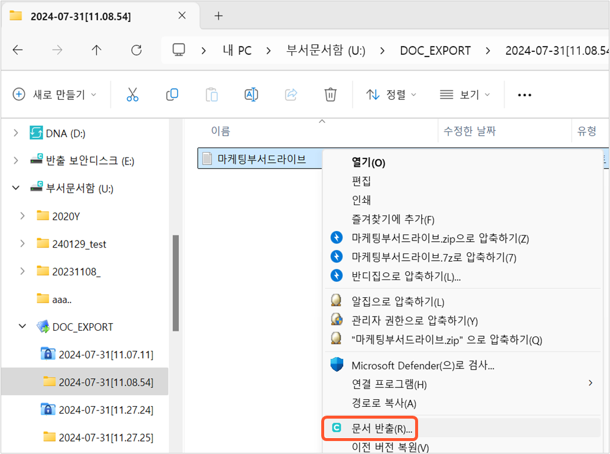

2. ‘**폴더 찾아보기**’ 창에서 반출 문서를 다운로드할 디스크와 폴더를 선택한 후 **확인** 버튼을 클릭하여 문서반출을 완료합니다.

<figure>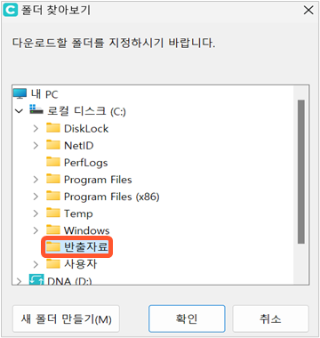<figcaption></figcaption></figure>

3. 선택한 폴더 아래에 반출 파일/폴더가 다운로드 됩니다.

<figure>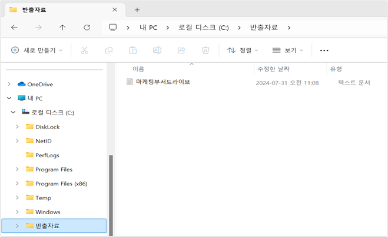<figcaption></figcaption></figure>

<mark style="color:$primary;">**반출 디스크**</mark><mark style="color:$primary;">(</mark><mark style="color:$primary;">**반출 보안디스크**</mark><mark style="color:$primary;">)</mark><mark style="color:$primary;">**로 반출하기**</mark>

1. DOC\_EXPORT 폴더 아래 반출하고자 하는 폴더/파일을 선택하고 오른쪽 마우스 클릭 후 **문서 반출** 메뉴를 선택합니다.
2. ‘**폴더 찾아보기’** 창에서 반출 보안디스크를 선택 후 확인 버튼을 클릭하면 아래 메시지가 표시됩니다.(메시지의 최초 표시 이후 해당 메시지 표시 여부는 사용자가 선택할 수 있습니다)

<figure>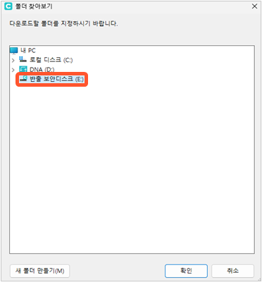<figcaption></figcaption></figure>

<figure>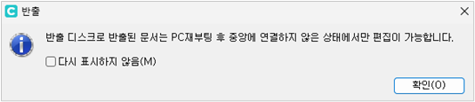<figcaption></figcaption></figure>

3. **확인** 버튼을 클릭하여 문서 반출을 완료합니다. 반출 보안디스크 아래로 선택한 폴더/파일이 다운로드 됩니다.


반출 보안디스크로 반출된 문서는 문서중앙화 서버에 로그인이 힘든 외부에서도 열람, 편집할 수 있으며, DiskLock에 의해 보호되어 정보 유출을 차단할 수 있습니다.

반출 보안디스크내 문서는 PC 재부팅 후 문서중앙화 서버에 연결하지 않은 상태에서만 편집이 가능합니다.


<mark style="color:$primary;">**이메일/메신저에 파일 첨부하여 외부로 전송하기**</mark>

공개반출이 승인된 문서에 한하여 메일, 메신저에 문서를 첨부하여 외부로 전송할 수 있습니다. 메일, 메신저에서 첨부 파일로 DOC\_EXPORT 폴더에 생성된 반출용 폴더 내 파일을 선택합니다. 이때, Drag\&Drop 또는 파일 복사&붙여넣기로 파일을 바로 첨부할 수 있습니다.\
반출이 승인되지 않은 파일을 첨부하고자 할 경우는 다음과 같은 경고 메세지와 함께 작업이 중단됩니다.

<figure>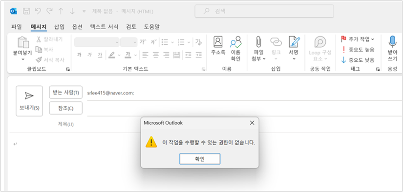<figcaption></figcaption></figure>

#### 보안반출 문서 반출하기

보안반출이 승인된 문서는 반출 디스크(반출 보안디스크)로만 반출이 가능합니다. 반출 절차는 공개 반출 문서를 반출 보안디스크로 반출하는 것과 동일합니다.

1. DOC\_EXPORT 폴더내 반출하고자 하는 폴더/파일을 선택하고 오른쪽 마우스 클릭 후 **문서 반출** 메뉴를 선택합니다.

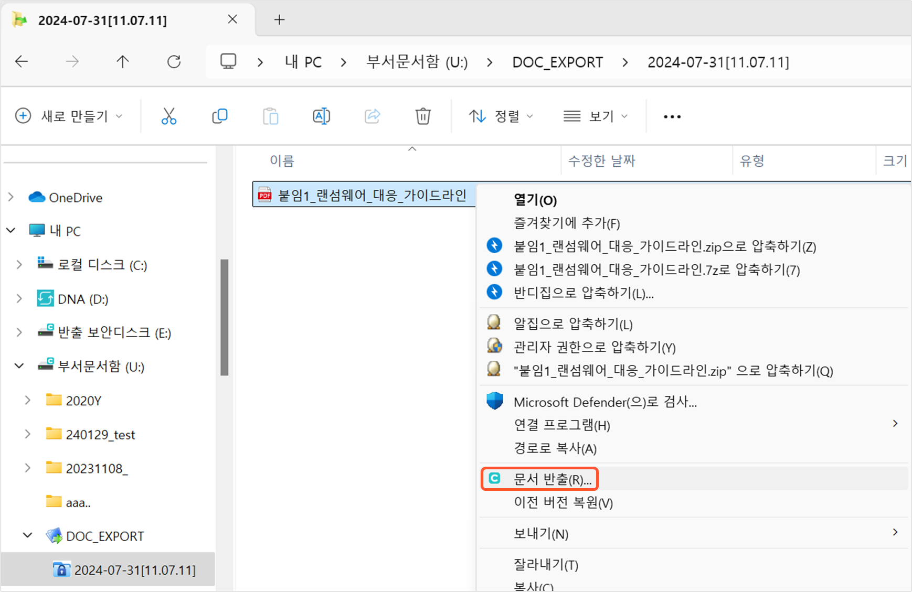

2. **‘폴더 찾아보기’** 창에서 반출 보안디스크를 선택 후 확인 버튼을 클릭 후 문서반출을 완료합니다.

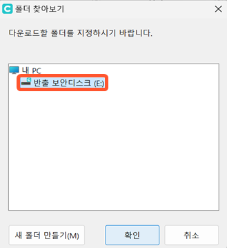


사용자는 윈도우 에이전트의 **‘알림 관리’**&#xCC3D;에서도 반출 승인된 문서의 반출 작업을 할 수 있습니다.

1\. 문서중앙화 트레이 아이콘을 우클릭하여 **알림 관리**를 클릭합니다.

2\. 알림 관리창에서 반출 승인 알림을 선택합니다.

3\. 알림 관리 창 하단의 **내려받기**를 클릭합니다.

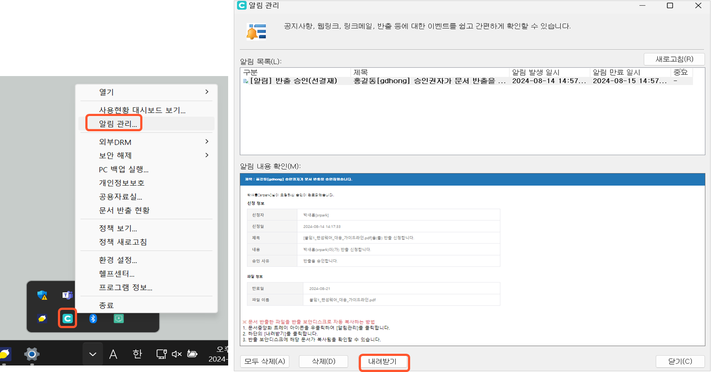

\
4\. **‘폴더 찾아보기’** 창에서 반출 문서를 다운로드할 디스크와 폴더를 선택한 후 **확인** 버튼을 클릭하여 문서반출을 완료합니다.


